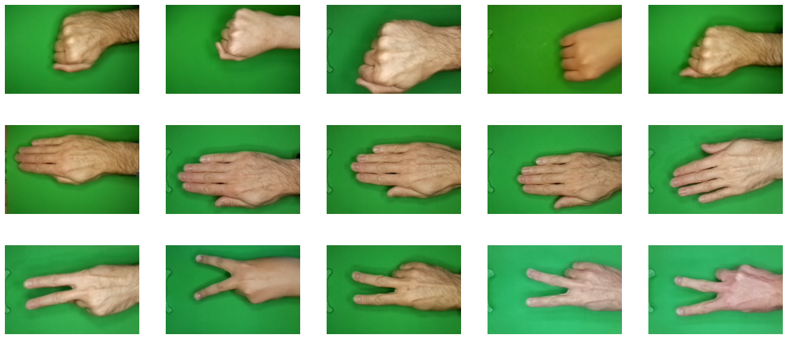
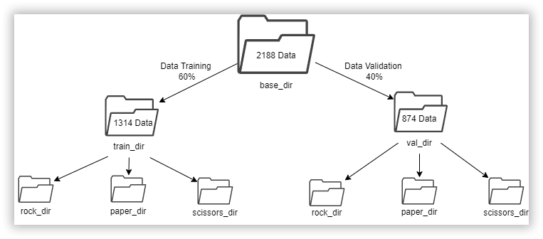
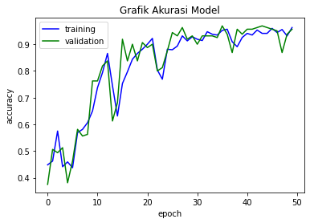
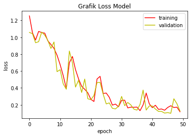
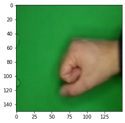
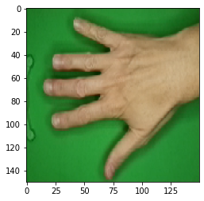

Here’s the updated README.md with the screenshots you provided:

---

# Rock-Paper-Scissors Classification Using CNN

This project applies deep learning to classify hand gestures representing **rock**, **paper**, and **scissors**. It leverages **Convolutional Neural Networks (CNN)**, along with **data augmentation** and **image preprocessing**, to achieve high accuracy in a multiclass classification task.

---

## Table of Contents

1. [Project Overview](#project-overview)
2. [Dataset Description](#dataset-description)
3. [Model Architecture](#model-architecture)
4. [Training Process](#training-process)
5. [Evaluation Metrics](#evaluation-metrics)
6. [Results](#results)
7. [Use Case](#use-case)
8. [How to Use](#how-to-use)
9. [Dependencies](#dependencies)
10. [Acknowledgments](#acknowledgments)

---

## Project Overview

Hand gestures such as rock, paper, and scissors are universally recognized, making them an ideal use case for image classification tasks. This project explores the use of CNNs to classify these gestures. The model was trained and tested using TensorFlow and Keras frameworks, achieving remarkable accuracy.

Key Highlights:
- **Dataset**: 2,188 labeled images categorized into rock, paper, and scissors classes.
- **Model**: A CNN model trained with transfer learning and augmented data.
- **Performance**: Achieved an accuracy of over **96%** during training and validation.
- **Environment**: Developed using Python in Google Colaboratory.

---

## Dataset Description

The dataset consists of labeled images sourced from [Dicoding Academy](https://github.com/dicodingacademy/assets/releases/download/release/rockpaperscissors.zip). It is split into training and validation sets as follows:

- **Training Set**: 1,314 images (60% of the dataset)
- **Validation Set**: 874 images (40% of the dataset)

Each image was resized to **150x150 pixels** for uniform input to the CNN model.

### Dataset Preview
**Rock-Paper-Scissors Sample Images**:


---

## Model Architecture

The model employs a sequential CNN architecture designed for feature extraction and classification:

1. **Convolutional Layers**:
    - 3 convolutional layers with ReLU activation.
    - MaxPooling layers for dimensionality reduction.
2. **Fully Connected Layers**:
    - Flattening layer to convert 2D feature maps into 1D vectors.
    - Dense layers with 128 and 512 neurons, followed by a softmax output layer for multiclass classification.
3. **Regularization**:
    - Dropout (55%) to prevent overfitting.
4. **Optimizer**: Adam optimizer with a learning rate of 0.0007.
5. **Loss Function**: Categorical cross-entropy for multiclass classification.

Optional: Transfer learning with **VGG16** was explored for enhanced feature extraction.

---

## Training Process

### Key Features:
1. **Data Augmentation**:
    - Random rotation up to 40 degrees.
    - Horizontal flips, zoom, and brightness adjustments.
    - Normalized pixel values to improve model generalization.
2. **Dataset Partitioning**:
    - **Training Data**: 60% of the dataset.
    - **Validation Data**: 40% of the dataset.

**Dataset Partition Preview**:


3. **Early Stopping**: Training halts once accuracy exceeds **96%**.
4. **Training Environment**:
    - Conducted in Google Colaboratory.
    - Training completed in under 30 minutes.

---

## Evaluation Metrics

The model was evaluated based on:
- **Accuracy**: Overall correctness of predictions.
- **Loss**: Difference between predicted and actual values.
- **Confusion Matrix**: Visualizes classification results.

---

## Results

### Training and Validation Accuracy



### Training and Validation Loss



### Sample Predictions
- **Rock**:
  
- **Paper**:
  
- **Scissors**:
  

### Final Accuracy:
- **Training Accuracy**: >96%
- **Validation Accuracy**: >95%

---

## Use Case

This repository is useful for developers, educators, and students learning about CNNs for image classification. It provides a hands-on demonstration of applying deep learning to a simple yet effective task like hand gesture recognition.

---

## How to Use

### Steps to Run:
1. Download the dataset:
    ```
    wget https://github.com/dicodingacademy/assets/releases/download/release/rockpaperscissors.zip
    ```
2. Extract the dataset and place it in the project folder.
3. Install required dependencies:
    ```
    pip install tensorflow keras matplotlib
    ```
4. Run the Jupyter Notebook on Google Colab:
    - Train the model from scratch or use pre-trained weights provided in the repository.
5. Test the model by uploading custom images with a green-screen background.

---

## Dependencies

The project requires the following:
- TensorFlow 2.8.2
- Keras
- Matplotlib
- Python 3.7 or higher

---

## Acknowledgments

This project was completed as part of Dicoding Academy's "Machine Learning for Beginners" course. Special thanks to:
- **Dicoding Academy** for the dataset and guidance.
- The TensorFlow and Keras teams for their excellent documentation and tools.

---

### Ethical Statement

Plagiarism is discouraged. Please give credit to this repository if you find it useful for your work or research. Learning and innovation thrive on integrity and collaboration.

---

Let me know if you need further refinements or additional elements!